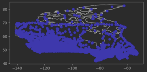

# Technologies and Architecture

## Final architecture
### Apache Spark

### Amazon Elastic MapReduce (EMR) 

### Amazon Simple Storage Service (S3)

### Amazon Glue

### Amazon Athena

### Amazon Quicksight

## Evaluation of various technologies
### Visualization
**Problem**\
To find an optimal location, we need to compare the measurement data based on their state, coordinates and evaluation.
We need a tool that can visualize our results on a map. We need visualizations like geographical maps, box plots and heat maps.
Also, we want to compare measurements over time. The loading should be fast, and the querying of data should be easily understandable.
We don't want to implement a visualization solution from scratch and also to configure too much.

**Comparison**\
*Matplotlib*\
Matplotlib needs us to use GeoPandas, so we need to transform Spark's Dataframes into Panda's Dataframes. This approach would take more computation power. Furthermore, we must implement every graph from scratch and deploy a frontend. We tried it out to visualize the stations on a map of Canada.

The corresponding code can be found here . 
We don't want to work on-premise, as we have to think about deployments and scaling by ourselves. The effort is too much.

*Seaborn*\
Similar arguing as with Matplotlib.

*Elastic Cloud and Kibana*\
Elastic's Visualization Tool Kibana can be connected with AWS, but we would need an entirely new IAM (new credentials and role management) and Elastic's cloud products aren't free. Therefore, we wouldn't save costs (only during the trial period)
Additionally, Kibana is more optimized for Elastic's products, especially it's search engine and document-oriented database Elasticsearch (https://www.elastic.co/guide/en/logstash/current/plugins-inputs-s3.html)
We could setup Kibana on-premise and use it for free, but we would need to deploy it, make it accessible from outside and think about scaling. That's not what we want. 
We want to rely on SaaS and focus on our problem statement instead of inventing the wheel.

*Tableau*\
Similar arguing as with Kibana.

*Amazon Quicksight*\
This web service can be used on-demand in our existing AWS setup (centralized services, same system environment) with the same IAM, and doesn't need much configuration effort for the initial set up and further usage. It is optimized and well-documented for AWS products 
More benefits include
 * queries can be created in natural language
 * efficient scaling as QuickSight is serverless
 * usage-based pricing, so our pipelines can rerun on new data every year, and we would only pay for the new computation
 * provides dashboards and an export feature
 * compatible to a variety of data sources (csv files, SaaS data sources, file sources or relational data sources like Amazon Athena, Amazon Redshift, Amazon S3)

## Conclusion
By comparing all the pros and cons concerning our problem statement, we decided to use Amazon Quicksight. A connection to other web services takes less effort, QuickSight is well-documented, and we will rely on only one set of products: Amazon.

### Amazon DynamoDB
* We experienced massive loading times from S3 to Athena 
* Needs a lambda function as a connector 
* We would create multiple copies of our dataset 
* More complex architecture 
* No cost benefit (the DB has to run, serverless computations are better)
* Solution:
  * We will store the raw data in S3, transform it via EMR and store it in another bucket. 
  * We will use AWS Glue to connect Athena with our S3 buckets, so we replace DynamoDB and Lambda with AWS Glue and connect our dataset directly to Athena. 
  * Athena is serverless, so we only pay what we execute
 
### Redshift-Spectrum vs Athena
* Redshift Spectrum runs with Amazon Redshift, while Athena is a standalone query engine for querying data stored in Amazon S3.

* With Redshift Spectrum, you have control over resource provisioning, while in the case of Athena, AWS allocates resources automatically.

* The performance of Redshift Spectrum depends on your Redshift cluster resources and optimization of S3 storage, while the performance of Athena only depends on S3 optimization. Initial transformation work was completed at S3 with EMR cluster. Data stored as parquet files and partitioned according to requirement (observation type).

* Redshift Spectrum can be more consistent performance-wise while querying in Athena can be slow during peak hours since it runs on pooled resources.

* Redshift Spectrum is more suitable for running large, complex queries, while Athena is more suited for simplifying interactive queries.

* Redshift Spectrum needs cluster management, while Athena allows for a truly serverless architecture.

* A data warehouse like Amazon Redshift is your best choice when you need to pull together data from many different sources – like inventory systems, financial systems, and retail sales systems – into a common format, and store it for long periods of time, to build sophisticated business reports from historical data; then a data warehouse like Amazon Redshift is the best choice. When you need to run queries against highly structured data with lots of joins across lots of very large tables, you should choose Amazon Redshift.
 
By comparison, query services like Amazon Athena make it easy to run interactive queries against data directly in Amazon S3 without worrying about formatting data or managing infrastructure. For example, Athena is great if you just need to run a quick query on some web logs to troubleshoot a performance issue on your site. With query services, you can get started fast. You just define a table for your data and start querying using standard SQL.
 
You can also use both services together. If you stage your data on Amazon S3 before loading it into Amazon Redshift, that data can also be registered with and queried by Amazon Athena.
Since our GHCN data was highly-relational and well partitioned and stored on S3, we were able to directly use a query service like athena to complete further analysis.

### Athena results - storing|editing|downloading|accessing

* AWS stores athena query results automatically to S3 buckets. These results include .csv and .txt of both result and metadata.
* The result from recent queries are stored upto 45 days and automatically deleted after that. But we can choose to extend this duration should we need the result for a longer duration
* The results can be viewed at anytime, edited and even downloaded for further analysis or visualization.
https://docs.aws.amazon.com/athena/latest/ug/querying.html
