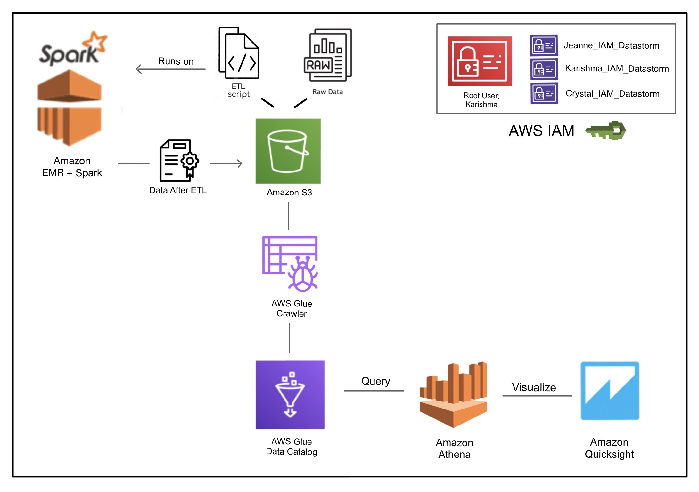

# Technologies and Architecture

## Final architecture

### Apache Spark
All ETL for this project has been performed using Apache Spark. The raw GHCNd data including - the information on different station id, station name, observation types, duration for which the record was monitored, and the value of these observations - are in .dly and .txt files. With the help of Spark and data frames, we first implemented extraction and transformation of useful information into a predefined schema. For further transformation we used the similar cleaned data available on the cluster provided for this course. As per our requirement, we further transformed the data into parquet files partitioned on observation values and stored it to our S3 bucket. This entire transformation was done with the help of Spark+DataFrames on the EMR cluster.

### Amazon Elastic MapReduce (EMR) 
Amazon EMR (previously called Amazon Elastic MapReduce) is a managed cluster platform that simplifies running big data frameworks, such as Apache Hadoop and Apache Spark, on AWS to process and analyze vast amounts of data. The central component of Amazon EMR is the cluster which is a collection of Amazon Elastic Compute Cloud (Amazon EC2) instances. The cluster as a whole can be configured to install distributed applications such as Apache Spark and Hadoop on each instance, also called nodes which essentially enable distributed processing. 

In our architecture, we create a cluster for the purpose of running spark jobs with 1 master and 2 worker nodes/instances of type - c7g.xlarge. Our EMR Cluster is used to perform the ETL Phase of the project wherein we run the Python scripts for the Spark application on the cluster which read the data from the S3 Bucket optimized with S3Select filter to efficiently reduce the amount of data that Amazon S3 transfers thus reducing the cost and latency to retrieve this data. The data after ETL is partitioned by the observation values and stored back into an S3 bucket as parquet files. All of the cluster configurations as well as partitioning details are provided [here](../Parallelization/README.md). 

### Amazon Simple Storage Service (S3)
Amazon Simple Storage Service (Amazon S3) is an object storage service that offers industry-leading scalability, data availability, security, and performance and can be used to store and protect any amount of data for a range of use cases, such as data lakes, websites, mobile applications, backup and restore, archive, enterprise applications, IoT devices, and big data analytics. For our methodology, we use different S3 buckets to store the Raw Data, the scripts required by the Spark Application on the EMR Cluster, the processed data after ETL, as well as to hold the outputs of the queries performed subsequently in Athena. We also use S3 as a data lake to use in conjunction with AWS Glue Crawler and Catalog to obtain the final tables used for the analysis and visualization phase of the project.

### Amazon Glue
Athena can only use the data stored in Amazon S3 after using the AWS Glue Data Catalog. AWS Glues provides a file crawler that we use to add metadata, like table and column names, to the data stored in S3. The mapping of our S3 filesystem to databases, tables, and views appears then in Athena's query editor.

### Amazon Athena
Amazon Athena is an interactive query service that makes it easy to analyze data directly in Amazon Simple Storage Service (Amazon S3) using standard SQL. Amazon Athena also makes it easy to interactively run data analytics using Apache Spark without having to plan for, configure, or manage resources. 

Athena SQL and Apache Spark on Amazon Athena are serverless, so there is no infrastructure to set up or manage, and we pay only for the queries we run. Athena scales automatically—running queries in parallel—so results are fast, even with large datasets and complex queries. This also expands the future scope of the project since these services can be easily scaled to deal with data that are many times larger than the current. Further, we used Athena in our architecture because it also easily integrates with the AWS Glue Data Catalog, which offers a persistent metadata store for our data which is in Amazon S3. This allowed us to create tables and query data in Athena based on a central metadata store available throughout our Amazon Web Services account and integrated with the ETL and data discovery features of AWS Glue and Crawlers. Further reasoning behind why we preferred to work with Amazon Athena over Redshift + Spectrum is detailed here.

### Amazon Identity & Access Management (IAM) 
AWS Identity and Access Management is used to control who and what can access the different services and resources. It allows us to set and manage fine-grained access control for users and AWS Services. By specifying permissions for users and assigning roles to different AWS services, we are able to provide these with temporary security credentials for workloads that access your AWS resources while assigning them the least privileges required by them as governed by the best practices. Further, we can also manage multiple identities across a single AWS account by creating IAM Users under the root account. Following this, as depicted in the figure, we have implemented all of our architecture in a single AWS account and created three IAM users for ourselves within it.

### Amazon Quicksight
Amazon QuickSight is a business analytics web service that makes it easy to build visualizations, perform ad-hoc analysis, and quickly get insights from data, anytime, on any device. It can be connected to Redshift, S3 or Athena. It is also possible to use Amazon’s Lambda Connector to use a broader variety of services. In this project, we mainly worked with Athena and Quicksight. Therefore, Quicksight submitted queries that were executed in Athena.

## Evaluation of various technologies
### Visualization
**Problem**\
To find an optimal location, we need to compare the measurement data based on their state, coordinates and evaluation.
We need a tool that can visualize our results on a map. We need visualizations like geographical maps, box plots and heat maps.
Also, we want to compare measurements over time. The loading should be fast, and the querying of data should be easily understandable.
We don't want to implement a visualization solution from scratch and also to configure too much.

**Comparison**\
*Matplotlib*\
Matplotlib needs us to use GeoPandas, so we need to transform Spark's Dataframes into Panda's Dataframes. This approach would take more computation power. Furthermore, we must implement every graph from scratch and deploy a frontend. We tried it out to visualize the stations on a map of Canada. \
 \
The corresponding code can be found here . 
We don't want to work on-premise, as we have to think about deployments and scaling by ourselves. The effort is too much.

*Seaborn*\
Similar arguing as with Matplotlib.

*Elastic Cloud and Kibana*\
Elastic's Visualization Tool Kibana can be connected with AWS, but we would need an entirely new IAM (new credentials and role management) and Elastic's cloud products aren't free. Therefore, we wouldn't save costs (only during the trial period)
Additionally, Kibana is more optimized for Elastic's products, especially it's search engine and document-oriented database Elasticsearch (https://www.elastic.co/guide/en/logstash/current/plugins-inputs-s3.html)
We could setup Kibana on-premise and use it for free, but we would need to deploy it, make it accessible from outside and think about scaling. That's not what we want. 
We want to rely on SaaS and focus on our problem statement instead of inventing the wheel.

*Tableau*\
Similar arguing as with Kibana.

*Amazon Quicksight*\
This web service can be used on-demand in our existing AWS setup (centralized services, same system environment) with the same IAM, and doesn't need much configuration effort for the initial set up and further usage. It is optimized and well-documented for AWS products 
More benefits include
 * queries can be created in natural language
 * efficient scaling as QuickSight is serverless
 * usage-based pricing, so our pipelines can rerun on new data every year, and we would only pay for the new computation
 * provides dashboards and an export feature
 * compatible to a variety of data sources (csv files, SaaS data sources, file sources or relational data sources like Amazon Athena, Amazon Redshift, Amazon S3)

## Conclusion
By comparing all the pros and cons concerning our problem statement, we decided to use Amazon Quicksight. A connection to other web services takes less effort, QuickSight is well-documented, and we will rely on only one set of products: Amazon.

### Amazon DynamoDB
* We experienced massive loading times from S3 to Athena 
* Needs a lambda function as a connector 
* We would create multiple copies of our dataset 
* More complex architecture 
* No cost benefit (the DB has to run, serverless computations are better)
* Solution:
  * We will store the raw data in S3, transform it via EMR and store it in another bucket. 
  * We will use AWS Glue to connect Athena with our S3 buckets, so we replace DynamoDB and Lambda with AWS Glue and connect our dataset directly to Athena. 
  * Athena is serverless, so we only pay what we execute
 
### Redshift-Spectrum vs Athena
* Redshift Spectrum runs with Amazon Redshift, while Athena is a standalone query engine for querying data stored in Amazon S3.

* With Redshift Spectrum, you have control over resource provisioning, while in the case of Athena, AWS allocates resources automatically.

* The performance of Redshift Spectrum depends on your Redshift cluster resources and optimization of S3 storage, while the performance of Athena only depends on S3 optimization. Initial transformation work was completed at S3 with EMR cluster. Data stored as parquet files and partitioned according to requirement (observation type).

* Redshift Spectrum can be more consistent performance-wise while querying in Athena can be slow during peak hours since it runs on pooled resources.

* Redshift Spectrum is more suitable for running large, complex queries, while Athena is more suited for simplifying interactive queries.

* Redshift Spectrum needs cluster management, while Athena allows for a truly serverless architecture.

* A data warehouse like Amazon Redshift is your best choice when you need to pull together data from many different sources – like inventory systems, financial systems, and retail sales systems – into a common format, and store it for long periods of time, to build sophisticated business reports from historical data; then a data warehouse like Amazon Redshift is the best choice. When you need to run queries against highly structured data with lots of joins across lots of very large tables, you should choose Amazon Redshift.
 
By comparison, query services like Amazon Athena make it easy to run interactive queries against data directly in Amazon S3 without worrying about formatting data or managing infrastructure. For example, Athena is great if you just need to run a quick query on some web logs to troubleshoot a performance issue on your site. With query services, you can get started fast. You just define a table for your data and start querying using standard SQL.
 
You can also use both services together. If you stage your data on Amazon S3 before loading it into Amazon Redshift, that data can also be registered with and queried by Amazon Athena.
Since our GHCN data was highly-relational and well partitioned and stored on S3, we were able to directly use a query service like athena to complete further analysis.

### Athena results - storing|editing|downloading|accessing

* AWS stores athena query results automatically to S3 buckets. These results include .csv and .txt of both result and metadata.
* The result from recent queries are stored upto 45 days and automatically deleted after that. But we can choose to extend this duration should we need the result for a longer duration
* The results can be viewed at anytime, edited and even downloaded for further analysis or visualization.
https://docs.aws.amazon.com/athena/latest/ug/querying.html

### Examples
Under [img](img), there are examples on how to connect Quicksight with Athena, using a Lambda Connector for connecting Quicksight to DynamoDB or how an AWS Glue Crawler looks like.
