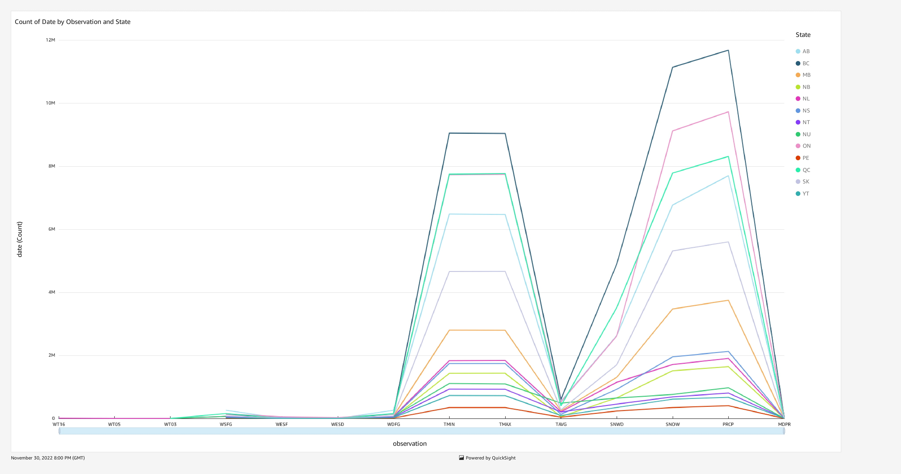
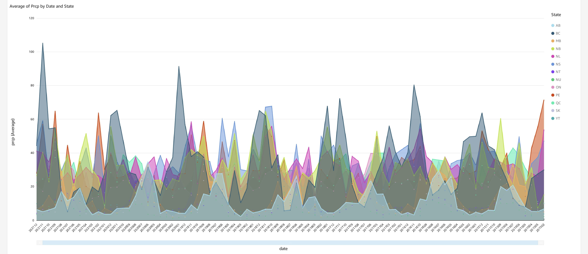
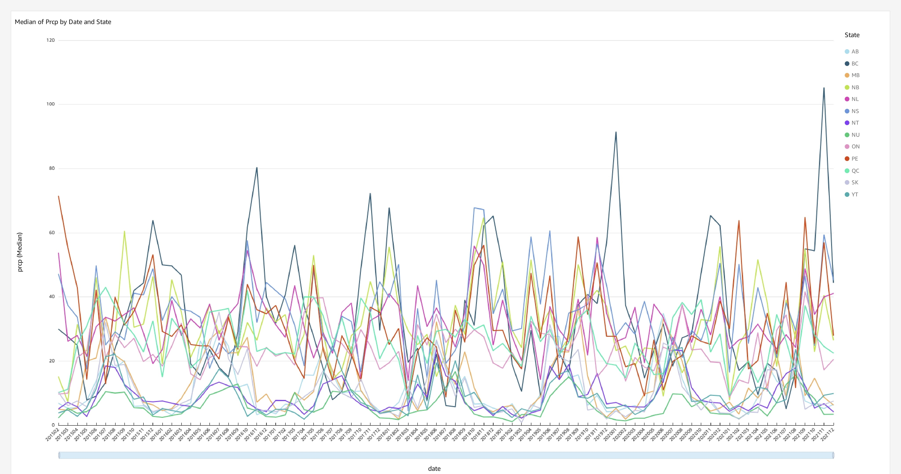
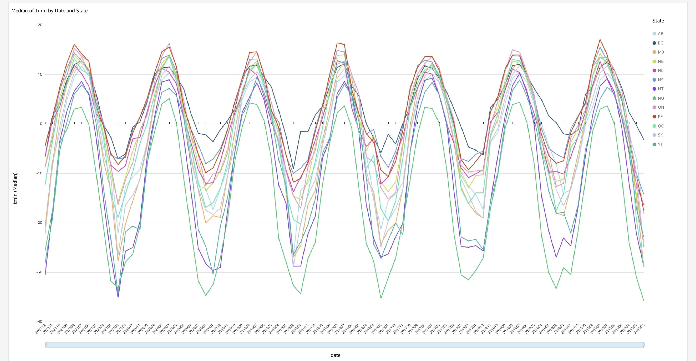
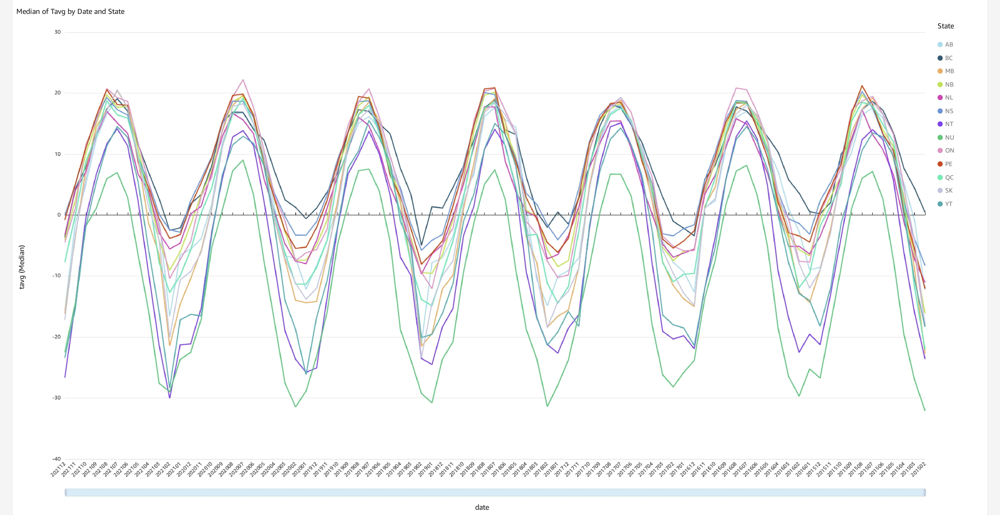
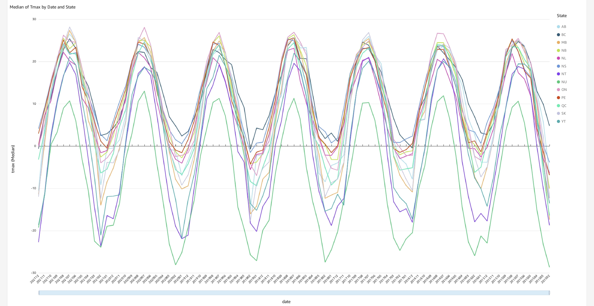
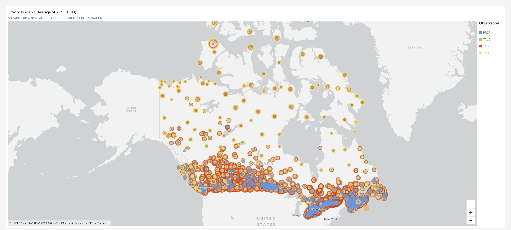
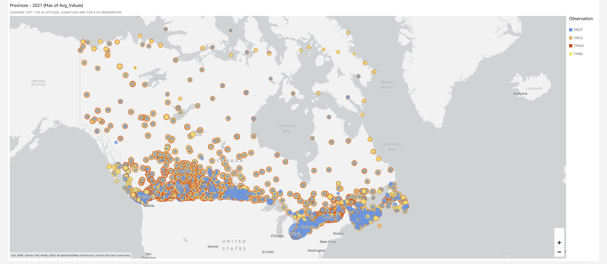
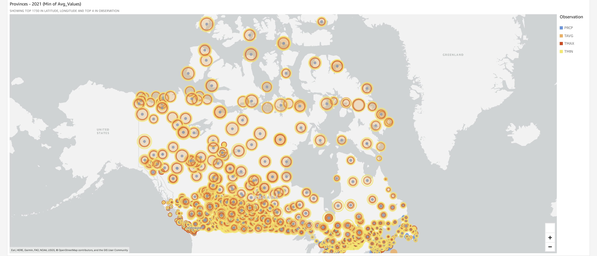
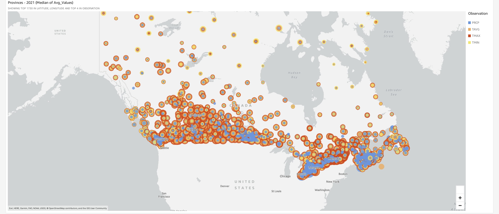

# Analysis of Precipitation, TMIN, TAVG and TMAX 

## Quicksight Dashboard Links
1. [Observtion Counts By State](https://us-west-2.quicksight.aws.amazon.com/sn/analyses/7a310935-b310-4e91-b198-e8562a9b29f6) 
2. [Timeseries Plot](https://us-west-2.quicksight.aws.amazon.com/sn/analyses/92a16525-56d2-4e71-becf-c07ac5e5ae48)
3. [Geomaps](https://us-west-2.quicksight.aws.amazon.com/sn/analyses/7e7cec77-da47-4e6f-9734-226486a315f5)

The dashboards were also exported as pdfs.

## 1. Overall Observation Counts for Each State (1900-2021)


## Conclusions

One of the first observations we can make is that there are a very few number of values for WT16 and WT05 which correspond to freezing rain and hail, respectively and thus due to insufficient data for these features, these observations were not included further in the analysis.

Also, from the plot above, we can conclude that the total number of days of precipitation in each state from 1700 - 2021 from highest to lowest are in the order of: 

British Columbia > Ontario > Quebec > Alberta > Saskatchewan > Manitoba > Nova Scotia > Newfoundland and Labrador > New Brunswick > Nunavut > Northwest Territories > Yukon Territory > Prince Edward Island

## 2. Time Series for Distribution of Values Over Time Across Each State (2015 to 2021)

## Query

```sql
SELECT station, "station name", latitude, longitude, elevation, state, date_format(date_parse(date,'%Y%m%d'), '%Y%m') AS "year-month", observation, avg(value) AS "avg_value"
FROM datastorm.observations
WHERE observation in ('PRCP', 'TMAX', 'TMIN', 'TAVG', 'WT05', 'WT16') AND date_format(date_parse(date,'%Y%m%d'), '%Y%m') >= '20150101'
GROUP BY station, "station name", date_format(date_parse(date,'%Y%m%d'), '%Y%m'), latitude, longitude, elevation, state, observation
```
The dataset created through this operation can be found [here.](https://us-west-2.quicksight.aws.amazon.com/sn/folders/public/26198150-65ea-42d0-9303-613dc6d65d75)


## Filters
- Grouped By State & Date 

## Plots
### Distribution Of Average Precipitation

### Distribution Of Median Precipitation 

### Distribution Of Median of Minimum Temperature

### Distribution Of Median of Average Temperature

### Distribution Of Median of Maximum Temperature



## 3. Geomaps For Visualizing Distribution Across Each State (2015 to 2021)

## Query
```sql
SELECT
    t1.state,
    date_format(date_parse(t1.date,'%Y%m%d'), '%Y%m') as date,
    avg(cast(t1.value AS DOUBLE)) as prcp,
    avg(cast(t2.value AS DOUBLE)/10) as tmax,
    avg(cast(t3.value AS DOUBLE)/10) as tmin,
    avg(cast(t4.value AS DOUBLE)/10) as tavg
FROM datastorm.observations t1
    INNER JOIN datastorm.observations t2 ON t1.station = t2.station AND t1.date = t2.date AND t2.observation = 'TMAX'
    INNER JOIN datastorm.observations t3 ON t1.station = t3.station AND t1.date = t3.date AND t3.observation = 'TMIN' AND t1.observation = 'PRCP'
    INNER JOIN datastorm.observations t4 ON t1.station = t4.station AND t1.date = t4.date AND t4.observation = 'TAVG'
WHERE date_format(date_parse(t1.date,'%Y%m%d'), '%Y%m') >= '20150101'
GROUP BY t1.state, date_format(date_parse(t1.date,'%Y%m%d'), '%Y%m')
```
The dataset created through this operation can be found [here.](https://us-west-2.quicksight.aws.amazon.com/sn/folders/public/26198150-65ea-42d0-9303-613dc6d65d75)

## Filters
- Grouped By State & Date 
- Avg_value < 400

## Plots
### GeoMaps For Average Values of PRCP, TMAX, TMIN, TAVG

### GeoMaps For Maximum Values of PRCP, TMAX, TMIN, TAVG

### GeoMaps For Minimum Values of PRCP, TMAX, TMIN, TAVG

### GeoMaps For Median Values of PRCP, TMAX, TMIN, TAVG


## Conclusions

From the above Geomaps and Timeseries plots we are able to understand that the five states with a consistently smaller distribution of rain in recent years were Nunavut, Manitoba, Saskatchewan, Northwest Territories and Alberta. However, from the minimum temperature plots of these states, we can see that Saskatchewan, Nunavut and Northwest Territories have very frigid temperatures most of the year thus not making them preferrable for those seeking refuge or those migrating due to climate conditions. Thus, we can suggest that when it comes to considering both rain and temperature variations, Manitoba and Alberta seem to be better choices. 

