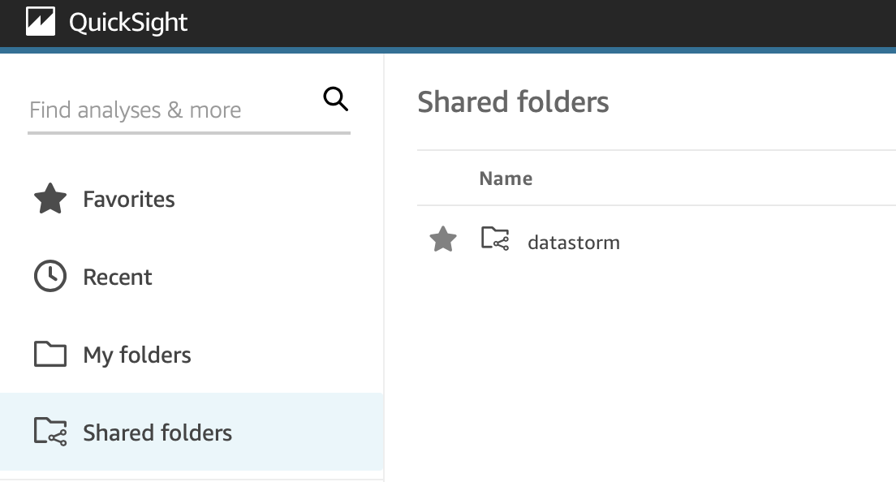

# Visualization
As described in [Technologies](../Technologies), we decided to use Amazon QuickSight as our visualization tool.
All of our data sources, analyses and dashboards can be found in the shared folder datastorm 

## Final results
1. [Snow](Snow)
2. [Wind](wind)
3. [Rain](Rain)

In British Columbia, places like Abbortsford, Barrowtown and Chilliwak had favourable temperatures but since there has been higher snowfall in the last couple of years some solutions could be provided in order to make them more comfortable dwelling places for new residents.
The best solution for a refugee settlement regarding stable wind data is the area of British Columbia, Manitoba and Ontario. On the east coast, there are too many winds and many storms. The same goes for Alberta. And even though there wasn't much (extreme) wind recorded in the territories in comparison to the provinces, they are too cold to be considered an appropriate living option.
When taking temperature and rain conditions throughout Canada into consideration, the states of Alberta and Manitoba look promising and serve as a middle ground such that the temperature variations and the precipitation through the years is less extreme. However, since our data also suggests that the amount of snowfall in these states is still quite high, we propose expansion and building of shelters that are specifically suited to persist and endure snowfall, thus serving as a safe haven for refugees and further expansion of the city. 
But this research should continue to gain deeper insights with a team of skilled meteorologists and access to more observations (e. g. specific weather types and more stations). But we are convinced that our architecture will fit the needs of the Canadian government since the proposed pipeline is easily scalable and the architecture is flexible to new needs.

## Optimization
From our initial question to analyzing the data, until we were finally able to visualize our result, we had to make many changes in our architecture and approaches.
Even though we transformed the data such that we can query over different measurements per day more efficiently and even though we joined
the metadata of stations with the measurements, the grade of denormalization still needs to be increased.
We experienced long loading times when querying the data with Quicksight and Athena.
That is because we aggregated the values per station, state and date and calculated the count, min, 
max, sum or average, grouped by dates repeatedly for different observations.
Instead of using cases and inner joins on our data table, we would initially add another transformation to our pipeline that does this for us.
In this case, we would save more computation power and could focus on more complex queries on our dataset, with which we can come to even more detailed insights.
Also, as our dataset is small compared to other data, we were thinking of transforming it into more than just one table, depending on our queries.

A further transformed table that has already been aggregated over different observations per station per month could look like the following:
State | Station | Longitude | Latitude | Elevation | YYYYMM | TMAX | TMIN | TAVG | SNOW | PRCP | WSFG | ...

A table that has already been aggregated over different observations per state could look like this:
State | TMAX | TMIN | TAVG | SNOW | PRCP | WSFG | ...

A table that groups values for a range of longitudes (or latitudes and elevations) could look like this:
Longitude Range | TMAX | TMIN | TAVG | SNOW | PRCP | WSFG | ...
